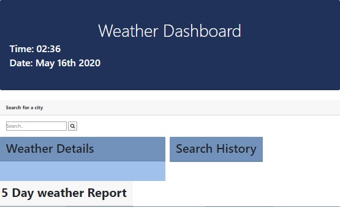
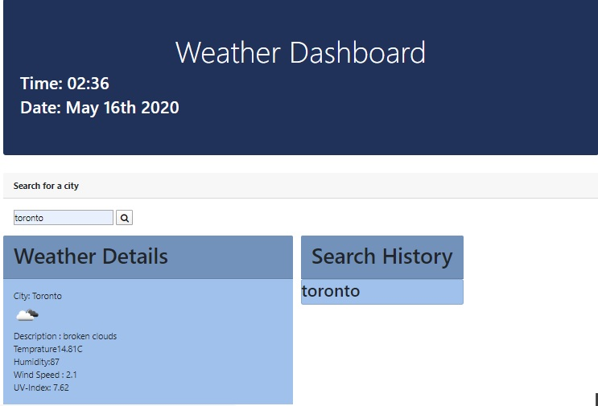
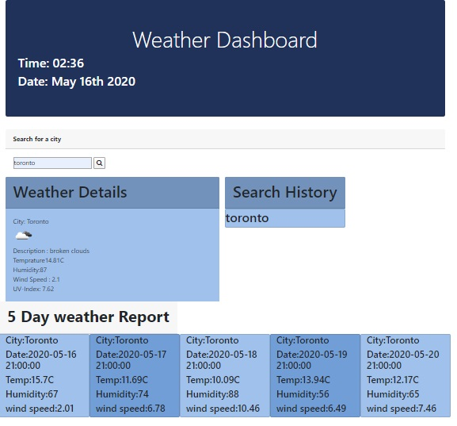

# Weather-Dashboard
This apllication is design to find weather report for entered location into search box. It displays Description, Temprature, Humidity, Wind Speed and UV-Index. It also shows weather for five days, current Day and Time and  keep track for recent search cities.

# User Story
This application helps user to find Weather Report.

# Technology 
HTML 5, Bootstrap, JavaScript, Moment min.js, Ajax, Weather API.

# Demo

## Weather Search

## Today's Weather

## Five Day Weather

